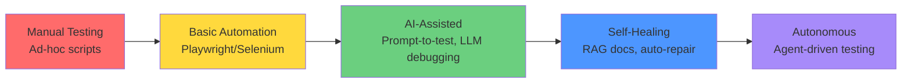
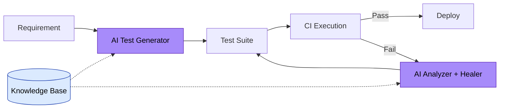

# 🚀 AI-Augmented QA & Engineering Accelerator

**Transform your testing team from manual executors to autonomous AI-augmented engineers.**

---

## Executive Summary

Modern engineering teams face an acceleration gap: manual testing can't keep pace with CI/CD velocity, while AI tools remain underutilized. This hands-on accelerator bridges that gap by training engineers in **Playwright automation**, **prompt engineering for test generation**, **RAG-based QA systems**, **self-healing test architectures**, and **autonomous testing agents**.

Participants graduate with production-ready skills to build AI-powered testing pipelines, slashing test maintenance costs and accelerating release cycles.

---

## Why This Matters Now

- **70% of test automation time** is spent on flaky tests and locator maintenance
- **AI can generate tests 10× faster** than manual authoring—but most teams don't know how
- **Autonomous agents** are replacing repetitive QA workflows—teams that don't adapt will fall behind
- **Hiring AI-savvy QA engineers** is expensive; **upskilling existing teams** delivers immediate ROI

**This program turns your QA team into a strategic asset.**

---

## Capability Maturity Model



**Where is your team today? Where will they be in 8 weeks?**

---

## Demo Projects Overview

This repository includes 5 production-quality demos that showcase AI-augmented testing capabilities:

| Demo | Capability | Business Impact |
|------|------------|-----------------|
| **01: Prompt-to-Test Generator** | Convert plain English → Playwright tests | 10× faster test authoring |
| **02: AI Failure Analyzer** | Auto-diagnose failed CI runs | 80% reduction in triage time |
| **03: Self-Healing Locators** | Intelligent selector fallback strategies | 60% fewer flaky tests |
| **04: RAG QA Assistant** | Knowledge base for test documentation | Instant onboarding, zero tribal knowledge |
| **05: Autonomous Agent** | Fully automated test generation & repair | Zero-touch test maintenance |

All demos run **offline by default** with optional AI API integration.

---

## Architecture: AI-Augmented Testing Pipeline



---

## Quickstart

```bash
# Clone the repository
git clone https://github.com/yourusername/ai-testing-accelerator.git
cd ai-testing-accelerator

# Install dependencies
pip install -r requirements.txt

# Run demos (no API keys required for default mode)
cd demos/01-prompt-to-test-generator
python generator.py "test user login with valid credentials"

cd ../02-ai-failure-analyzer
python analyzer.py sample-failure.log

cd ../05-autonomous-playwright-agent
python agent.py --intent "verify checkout flow"
```

See [`docs/setup.md`](docs/setup.md) for detailed instructions.

---

## Before vs. After

| Before Accelerator | After Accelerator |
|--------------------|-------------------|
| Manual test case writing (8 hrs/week) | AI-generated tests in seconds |
| 3-hour debugging sessions for CI failures | AI root cause analysis in 30 seconds |
| Flaky tests consume 40% of QA time | Self-healing locators prevent 60% of flakes |
| New QA hires take 3 months to onboard | RAG assistant enables same-day productivity |
| Test maintenance overhead grows with codebase | Autonomous agents keep tests current |

---

## What Participants Will Build

### **Week 1-2: Foundations**
- Python automation scripts with Playwright
- CI/CD integration with GitHub Actions
- API testing with requests library

### **Week 3-4: AI Augmentation**
- Prompt-engineered test generation
- LLM-powered failure analysis
- Self-healing selector strategies

### **Week 5-6: Advanced AI Systems**
- RAG-based QA knowledge assistant
- MCP-style agentic workflows
- CLI tools for AI testing

### **Week 7-8: Capstone Project**
Participants deploy a **custom autonomous testing agent** tailored to their company's tech stack:
- Auto-generates tests from tickets
- Self-heals on failure
- Reports to Slack/Jira
- Runs in CI/CD

---

## Curriculum Highlights

- **40 hours** of instructor-led training (alternate weekdays)
- **20+ hands-on labs** from beginner to advanced
- **5 production-grade demos** to customize
- **Capstone project** with live code review
- **30-day post-training support**

See [`curriculum/roadmap.md`](curriculum/roadmap.md) for the full learning path.

---

## ROI: Why This Investment Pays Off

**Cost of NOT Training:**
- $150K/year in flaky test firefighting (3 QA × 40% time × $125K salary)
- $80K/year in delayed releases (2 weeks/quarter × $40K opportunity cost)
- $200K/year hiring AI-savvy QA engineers instead of upskilling

**With This Program:**
- **$500/participant × 6 engineers = $3,000 total**
- Reduce test maintenance by 60%: **$90K/year saved**
- Accelerate releases by 25%: **$20K/quarter gained**
- **30× ROI in first year**

---

## Who Should Attend

- QA Engineers learning automation
- SDETs expanding AI capabilities
- DevOps engineers owning CI/CD quality gates
- Developers writing integration tests
- Engineering Managers building AI-first teams

**No AI experience required.** Python basics recommended but not mandatory.

---

## Program Details

**Format:** Live, hands-on training
**Schedule:** Mon/Wed/Fri, 2 hours/session + Q&A office hours
**Duration:** 8 weeks
**Class Size:** 6-12 participants
**Investment:** $500 per participant

**Includes:**
- Session recordings
- Full lab repository access
- Completion certificates
- Pre-assessment & final report
- 30-day Slack support

---

## Get Started

📧 **Interested in training your team?** Contact us at [training@example.com](mailto:training@example.com)

📅 **Book a demo session:** See these demos in action with your use cases

🎯 **Self-paced learning:** Start with our [Beginner Labs](labs/beginner/)

---

## Repository Structure

```
ai-testing-accelerator/
├── demos/           # 5 production-ready showcase projects
├── labs/            # Hands-on exercises (beginner → advanced)
├── curriculum/      # Weekly plans & learning outcomes
├── proposal/        # Executive pitch materials
├── architecture/    # System design docs with Mermaid diagrams
├── capstone/        # Final project guidelines
└── docs/            # Setup, FAQ, demo scripts
```

---

## License

MIT License - Free to use, modify, and distribute.

---

**Built with ❤️ for teams ready to accelerate into the AI era.**
