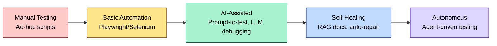
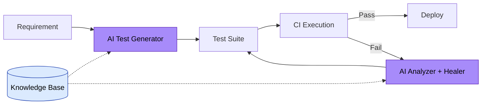

# 🚀 AI-Augmented QA & Engineering Accelerator

**Transform your testing team from manual executors to AI-augmented quality engineers.**

---

## Executive Summary

Modern engineering teams face an acceleration gap: manual testing can't keep pace with CI/CD velocity, while AI tools remain underutilized. This hands-on accelerator bridges that gap by training engineers in **Playwright automation**, **prompt engineering for test generation**, **RAG-based QA systems**, **self-healing test architectures**, and **autonomous testing agents**.

Participants graduate with practical skills to build AI-powered testing workflows, reduce test maintenance, and pilot agentic QA systems safely inside existing delivery pipelines.

---

## Why This Matters Now

- Flaky tests, brittle selectors, and slow triage still consume a meaningful share of QA and developer time
- AI can accelerate test planning, authoring, and debugging, but teams need repeatable patterns and review gates
- Agentic workflows are becoming useful for repetitive QA tasks when they are scoped, observable, and human-approved
- **Hiring AI-savvy QA engineers** is expensive; **upskilling existing teams** delivers immediate ROI

**This program turns your QA team into a strategic asset.**

---

## Capability Maturity Model



**Where is your team today? Where will they be in 8 weeks?**

---

## Demo Projects Overview

This repository includes 5 production-pattern reference demos that showcase AI-augmented testing capabilities:

| Demo | Capability | Business Impact |
|------|------------|-----------------|
| **01: Prompt-to-Test Generator** | Convert plain English → Playwright test drafts | Faster first-pass test authoring |
| **02: AI Failure Analyzer** | Classify failed CI runs | Faster, more consistent triage |
| **03: Self-Healing Locators** | Intelligent selector fallback strategies | Fewer locator-only failures |
| **04: RAG QA Assistant** | Knowledge base for test documentation | Faster onboarding, less tribal knowledge |
| **05: Autonomous Agent** | Agent loop for generation, execution, and repair | Pilot autonomous QA workflows safely |

All demos run **offline by default** with optional AI API integration.

---

## Architecture: AI-Augmented Testing Pipeline



---

## Quickstart

```bash
# Clone the repository
git clone https://github.com/yourusername/ai-testing-accelerator.git
cd ai-testing-accelerator

# Install dependencies
pip install -r requirements.txt

# Run demos (no API keys required for default mode)
cd demos/01-prompt-to-test-generator
python generator.py "test user login with valid credentials"

cd ../02-ai-failure-analyzer
python analyzer.py sample-failure.log

cd ../05-autonomous-playwright-agent
python agent.py --intent "verify checkout flow"
```

See [`docs/setup.md`](docs/setup.md) for detailed instructions.

---

## Before vs. After

| Before Accelerator | After Accelerator |
|--------------------|-------------------|
| Manual test case writing (8 hrs/week) | AI-generated tests in seconds |
| 3-hour debugging sessions for CI failures | AI root cause analysis in 30 seconds |
| Flaky tests consume 40% of QA time | Self-healing and quarantine workflows reduce repeat failures |
| New QA hires take 3 months to onboard | RAG assistant enables same-day productivity |
| Test maintenance overhead grows with codebase | Agentic workflows suggest targeted repairs with review gates |

---

## What Participants Will Build

### **Week 1-2: Foundations**
- Python automation scripts with Playwright
- CI/CD integration with GitHub Actions
- API testing with requests library

### **Week 3-4: Automation Mastery**
- Accessibility-first locator strategy
- Network mocking, auth state, and visual regression
- Parallel execution, reporting, and CI artifacts

### **Week 5-6: AI Augmentation**
- Prompt-engineered test generation
- LLM-powered failure analysis
- AI safety, structured outputs, and evals
- RAG-based QA knowledge assistant
- MCP-style agentic workflows
- CLI tools for AI testing

### **Week 7-8: Autonomous Systems + Capstone**
Participants build a **pilot-ready QA workflow** tailored to their company's tech stack:
- Generates or reviews tests from tickets or PR context
- Analyzes failures and suggests repairs
- Uses confidence gates, cost controls, and audit logs
- Integrates with CI, Slack, Jira, or GitHub in a controlled mode

---

## Curriculum Highlights

- **48 hours** of instructor-led training (Mon/Wed/Fri)
- **13 core labs + advanced stretch labs**
- **5 production-pattern demos** to customize
- **Pilot-ready capstone project** with live code review
- **30-day post-training support**

See [`curriculum/roadmap.md`](curriculum/roadmap.md) for the full learning path.

---

## ROI: Why This Investment Pays Off

Illustrative model for a 6-person QA team at $125K average fully loaded cost:

| Metric | Baseline | Target After Adoption | Annual Value |
|--------|----------|-----------------------|--------------|
| Time on flaky tests | 40% | 15% | $187K |
| CI triage time | 3 hrs/failure | 30 min/failure | $60K |
| Test authoring | 8 hrs/week | 1 hr/week | $110K |
| New-hire onboarding | 12 weeks | 4 weeks | $45K |

**Estimated annual value:** ~$400K  
**6-person cohort investment:** $3,000  
**Potential ROI:** up to ~130× when the workflows are adopted and measured

---

## Who Should Attend

- QA Engineers learning automation
- SDETs expanding AI capabilities
- DevOps engineers owning CI/CD quality gates
- Developers writing integration tests
- Engineering Managers building AI-first teams

**No AI experience required.** Python basics recommended but not mandatory.

---

## Program Details

**Format:** Live, hands-on training
**Schedule:** Mon/Wed/Fri, 2 hours/session + Q&A office hours
**Duration:** 8 weeks
**Class Size:** 6-12 participants
**Investment:** $500 per participant

**Includes:**
- Session recordings
- Full lab repository access
- Completion certificates
- Pre-assessment & final report
- 30-day Slack support

---

## Get Started

📧 **Interested in training your team?** Contact us at [sg@sgeneris.xyz](mailto:sg@sgeneris.xyz)

📅 **Book a demo session:** See these demos in action with your use cases

🎯 **Self-paced learning:** Start with our [Beginner Labs](labs/beginner/)

---

## Repository Structure

```
ai-testing-accelerator/
├── demos/           # 5 production-pattern showcase projects
├── labs/            # Hands-on exercises (beginner → advanced)
├── curriculum/      # Weekly plans & learning outcomes
├── proposal/        # Executive pitch materials
├── architecture/    # System design docs with Mermaid diagrams
├── capstone/        # Final project guidelines
└── docs/            # Setup, FAQ, demo scripts
```

---

## License

MIT License - Free to use, modify, and distribute.

---

**Built with ❤️ for teams ready to accelerate into the AI era.**
