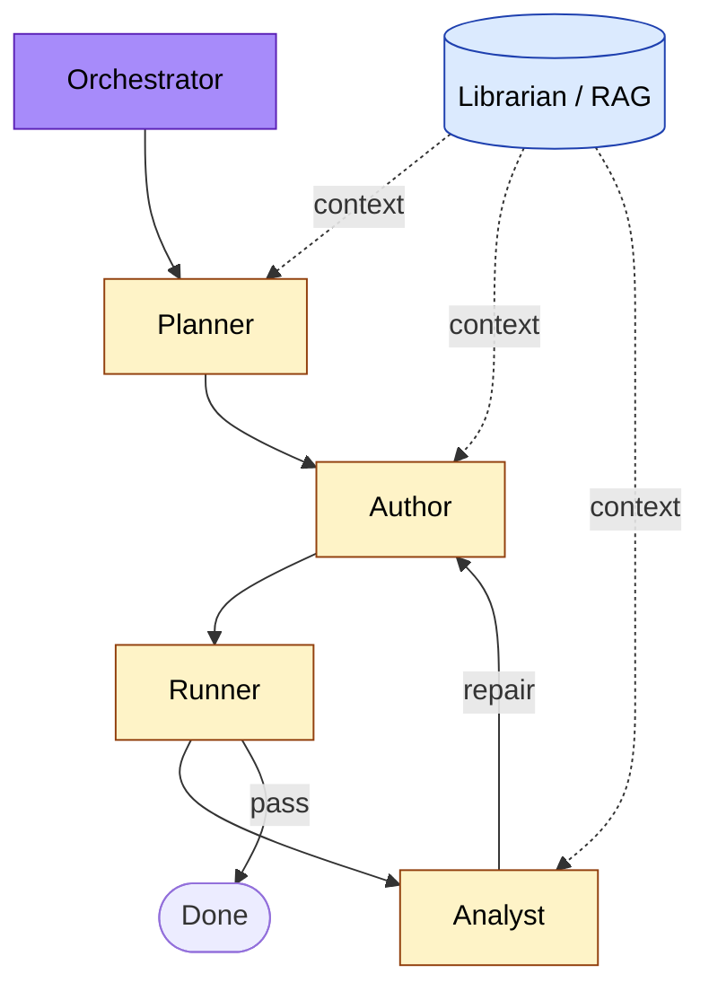
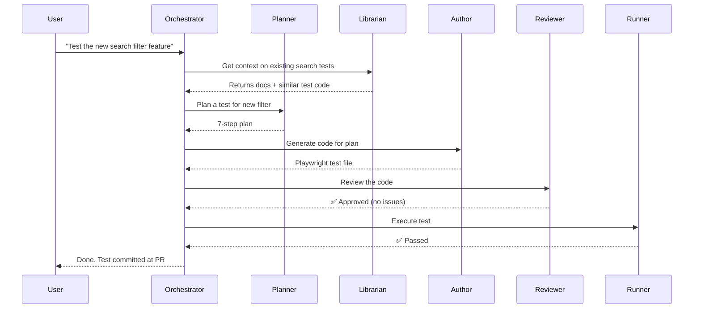
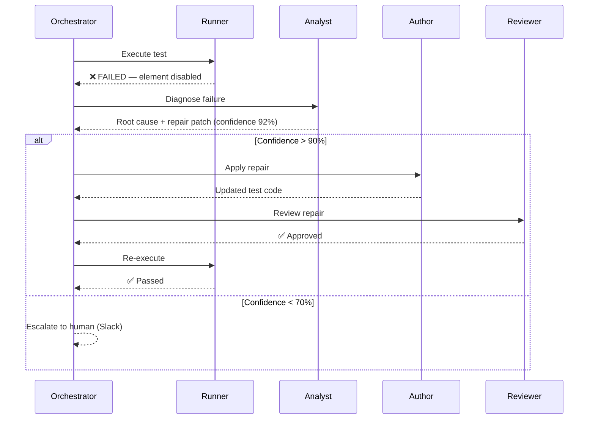

# Agentic QA System

A multi-agent architecture where specialized AI agents collaborate to own the testing lifecycle.

---

## Why Multi-Agent?

A single mega-prompt that "does QA" is fragile. Specialized agents — each with a narrow scope, defined tools, and clear handoffs — are:

- **More accurate** (focused context)
- **More observable** (clear boundaries between phases)
- **Easier to improve** (replace one agent without breaking others)
- **Cheaper to run** (small models for simple tasks)

This pattern mirrors how human QA teams work: a planner, an author, a reviewer, an analyst.

---

## System Architecture



The Reviewer and shared tools (filesystem, Playwright runtime, LLM provider) are intentionally omitted from this overview — they appear in the conversation flow diagrams below where they actually matter.

---

## Agent Roles

| Agent | Input | Output | Key Skill |
|-------|-------|--------|-----------|
| **Planner** | High-level intent | Step-by-step plan | Decomposition |
| **Author** | Plan | Playwright code | Code generation |
| **Reviewer** | Code | Approve/reject + comments | Critical eye |
| **Runner** | Code | Execution log | Environment management |
| **Analyst** | Failure log | Root cause + repair | Diagnostic reasoning |
| **Librarian** | Question | Cited answer | Retrieval (RAG) |
| **Orchestrator** | User intent | Final result | Routing + recovery |

---

## Conversation Flow (Happy Path)



---

## Conversation Flow (Failure + Repair)



---

## Inter-Agent Communication

Agents communicate via **structured messages**, not free-form text:

```json
{
  "from": "analyst",
  "to": "author",
  "task": "apply_repair",
  "context": {
    "test_file": "tests/checkout.spec.ts",
    "failed_step": 5,
    "root_cause": "ELEMENT_DISABLED",
    "confidence": 92,
    "patch": "await expect(locator).toBeEnabled();"
  }
}
```

This makes the system:
- **Auditable** — every message logged
- **Debuggable** — replay any conversation
- **Testable** — unit-test each agent in isolation

---

## Guardrails

Multi-agent systems can spiral. Key guardrails:

1. **Max iteration count** — orchestrator hard-stops after N loops
2. **Cost cap** — abort if LLM spend exceeds budget per task
3. **Human-in-loop triggers** — low confidence escalates immediately
4. **Diff size limits** — auto-repair only applies if patch < 50 lines
5. **Reviewer veto** — Reviewer agent can block any change

---

## Where the Demos Fit

This repo's demos are simplified slices of this architecture:

| Demo | Maps To |
|------|---------|
| Demo 01 | Author agent |
| Demo 02 | Analyst agent |
| Demo 03 | Self-healing capability (within Runner/Analyst) |
| Demo 04 | Librarian agent |
| Demo 05 | Mini-Orchestrator with embedded Planner/Author/Runner/Analyst |

The capstone project asks participants to add a 6th agent or extend the orchestrator with custom routing logic.

---

## Related

- [`ai-augmented-sdlc.md`](ai-augmented-sdlc.md) — broader SDLC integration
- [`autonomous-testing-pipeline.md`](autonomous-testing-pipeline.md) — CI/CD view
