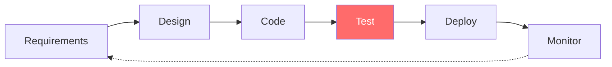
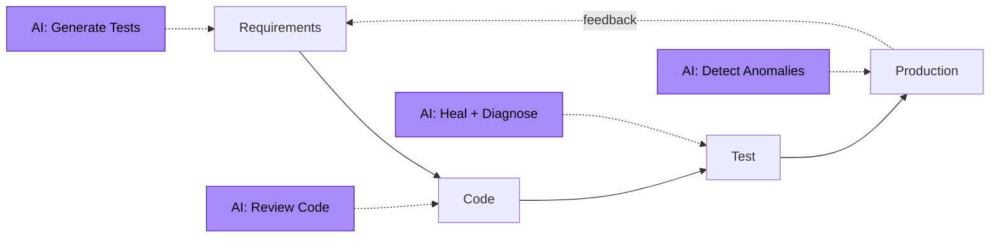
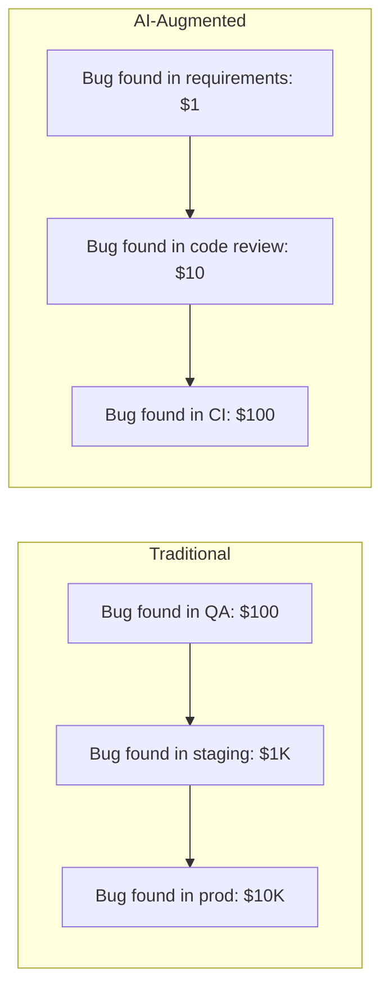

# AI-Augmented SDLC

How AI integrates into every phase of the software development lifecycle — from requirements to production.

---

## The Old SDLC

Testing is a **bottleneck stage**: it happens after coding, slows releases, and requires specialized humans.

---

## The AI-Augmented SDLC

Testing is **continuous and self-healing**. AI participates in every phase.

---

## AI Touchpoints by Phase

| Phase | AI Capability | Demo |
|-------|---------------|------|
| **Requirements** | Generate acceptance criteria + test plans from user stories | Demo 01 |
| **Design** | Suggest test coverage gaps | (architectural) |
| **Code** | AI code review for testability | (external tools) |
| **Test Authoring** | Prompt-to-test generation | Demo 01 |
| **Test Execution** | Parallel orchestration, flake detection | Demo 03 |
| **Failure Analysis** | Root cause + repair suggestion | Demo 02 |
| **Test Maintenance** | Self-healing locators | Demo 03 |
| **Knowledge** | RAG-grounded answers from docs | Demo 04 |
| **Autonomy** | End-to-end agent loops | Demo 05 |

---

## Why This Matters

Traditional SDLC optimizations focus on speeding up individual phases. AI-augmented SDLC **collapses the phases** — testing happens *during* requirements gathering and *during* code review, not after.

This shifts the cost curve:

**Cost of defects detected earlier = exponentially cheaper.**

---

## Implementation Roadmap

A team adopting this typically progresses through 5 levels (see capability maturity model in the main README):

1. **Manual** — humans do everything
2. **Automated** — Playwright/Selenium for happy paths
3. **AI-Assisted** — humans use AI tools (Copilot, ChatGPT) ad-hoc
4. **AI-Augmented** — AI is integrated into the SDLC pipeline (this program's target)
5. **Autonomous** — agents handle test lifecycle end-to-end (capstone)

Most teams skip from level 2 to level 4 in 6-8 weeks with this accelerator.

---

## Related Architecture Docs

- [`autonomous-testing-pipeline.md`](autonomous-testing-pipeline.md) — the CI/CD-level view
- [`agentic-qa-system.md`](agentic-qa-system.md) — multi-agent orchestration
