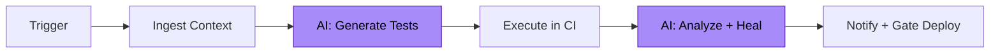
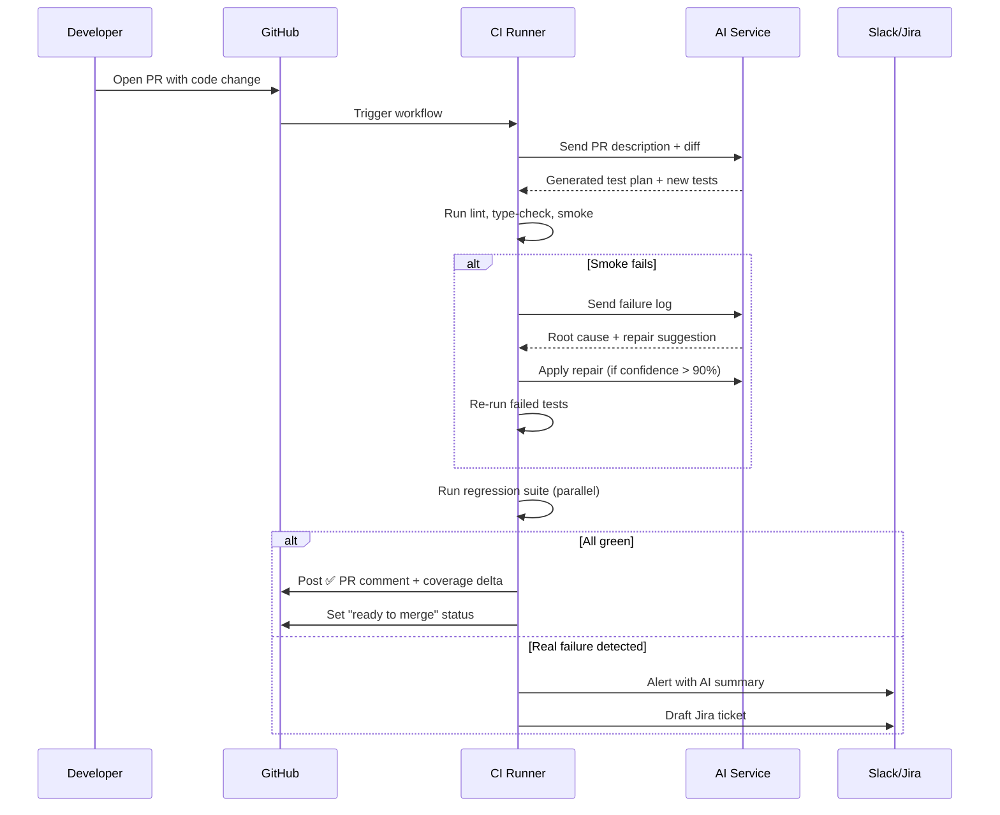

# Autonomous Testing Pipeline

A concrete CI/CD architecture for AI-augmented testing in a production setting.

---

## High-Level Pipeline

Each stage is detailed below:

| Stage | Inputs | Outputs |
|-------|--------|---------|
| **Trigger** | PR, push, cron, manual | Pipeline invocation |
| **Ingest** | Changed files, PR text, Jira links | Structured context |
| **Generate** | Context | New tests, coverage gaps, optimized plan |
| **Execute** | Tests | Logs, screenshots, traces |
| **Analyze** | Failure logs | Root cause + repair (or escalation) |
| **Notify** | Pass/fail + AI report | PR comment, Slack, Jira, deploy gate |

---

## Detailed Flow: PR Triggered Run

---

## Pipeline Components

### 1. Trigger Layer

Multiple entry points feed the pipeline:
- **PR-based** — every PR triggers a tailored test run
- **Main-branch** — full regression on merge
- **Scheduled** — nightly comprehensive sweep
- **Manual** — on-demand for specific suites

### 2. Ingestion Layer

The pipeline reads context that AI agents will use:
- **Changed files** → infer which tests need to run
- **PR description** → infer test intent
- **Linked Jira tickets** → understand acceptance criteria

### 3. AI Test Generation Layer

Three AI services run in parallel:
- **Prompt-to-Test Generator** (Demo 01) — creates new tests from intent
- **Coverage Gap Analyzer** — identifies untested code paths
- **Test Plan Optimizer** — picks the smallest set of tests to run

### 4. Execution Layer

Standard CI/CD stages, enhanced with AI:
- **Lint + type-check** — fast feedback loop
- **Smoke** — critical-path tests (~3 min)
- **Regression** — full suite, parallel sharding (~15 min)

### 5. Analysis Layer

When tests fail, AI takes over:
- **Failure Analyzer** (Demo 02) — root cause + confidence
- **Self-Healing Agent** (Demo 03) — auto-repair on selector drift
- **Flake Detector** — quarantines non-deterministic tests

### 6. Output Layer

Results flow to where humans live:
- **PR comments** with AI-summarized failures
- **Slack alerts** with one-click triage
- **Jira tickets** auto-drafted for real bugs
- **Deploy gates** that block bad releases

---

## Reliability Patterns

### Confidence Gating

Not every AI suggestion auto-applies. Confidence thresholds guard the pipeline:

| Confidence | Action |
|------------|--------|
| **> 95%** | Auto-apply repair, log it |
| **70-95%** | Suggest in PR comment, require human approval |
| **< 70%** | Escalate to senior engineer |

### Cost Controls

AI API spend can balloon. The pipeline enforces:
- **Caching** — identical prompts return cached results within 1 hour
- **Local-first** — pattern-matching tried before LLM calls
- **Budget alerts** — Slack notification at 80% of monthly cap

### Observability

Every AI decision is logged with:
- Input prompt
- Model + version
- Response
- Confidence score
- Final action taken
- Outcome (success/failure)

This supports auditing and continuous improvement.

---

## Performance Targets

| Metric | Target | Mechanism |
|--------|--------|-----------|
| PR feedback time | < 5 min | Selective test execution |
| Full regression | < 20 min | Parallel sharding (8 workers) |
| Flake rate | < 2% | Self-healing + quarantine |
| AI cost per PR | < $0.50 | Caching + local-first |
| False-positive failure rate | < 5% | Confidence gating |

---

## Related

- [`ai-augmented-sdlc.md`](ai-augmented-sdlc.md) — the broader SDLC view
- [`agentic-qa-system.md`](agentic-qa-system.md) — multi-agent details
