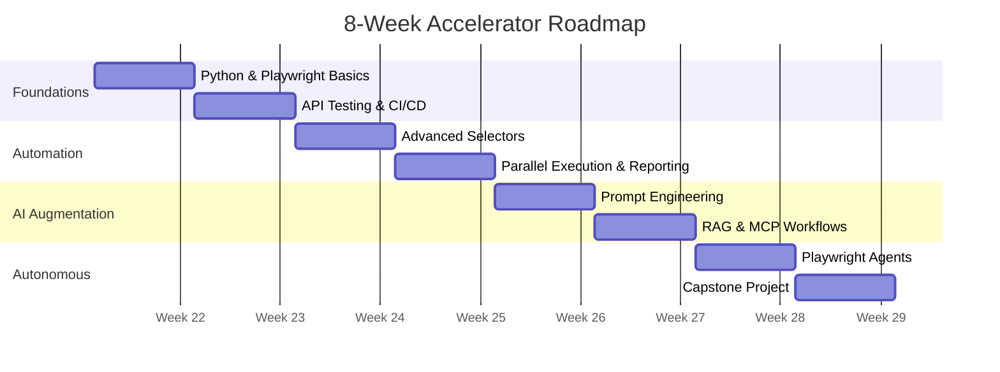
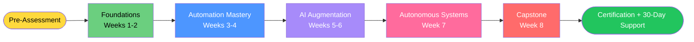

# 🗺️ Learning Roadmap

## AI-Augmented QA & Engineering Accelerator — 8-Week Path

---

## Learning Path Overview

---

## Phase 1: Foundations (Weeks 1-2)

**Goal:** Get every participant fluent in Python automation and Playwright fundamentals.

### Topics
- Python 3.10+ essentials (functions, classes, async, typing)
- Playwright installation and project setup
- Page Object Model pattern
- Locator strategies and best practices
- GitHub Actions CI/CD basics
- Test reporting and screenshots

### Outcomes
- Run a full Playwright test suite locally
- Push to GitHub and trigger CI runs
- Author 10+ basic E2E tests

---

## Phase 2: Automation Mastery (Weeks 3-4)

**Goal:** Build production-grade automation patterns.

### Topics
- Advanced locators (`getByRole`, `getByTestId`, accessibility-first)
- Network interception and mocking
- API testing with `requests` and `httpx`
- Parallel execution and sharding
- Visual regression testing
- Allure/HTML reports

### Outcomes
- Refactor messy tests into Page Object Model
- Build hybrid UI + API test suites
- Run tests in parallel under 5 minutes

---

## Phase 3: AI Augmentation (Weeks 5-6)

**Goal:** Apply AI techniques to accelerate testing workflows while keeping outputs measurable and reviewable.

### Topics
- Prompt engineering principles (few-shot examples, decomposition, structured output)
- LLM-powered test generation
- AI failure analysis and root cause prediction
- Evaluation datasets, confidence scoring, and human approval gates
- RAG fundamentals: chunking, embedding, retrieval
- MCP (Model Context Protocol) basics
- Building CLI tools with Click/Typer

### Outcomes
- Generate test plans and Playwright drafts from plain English
- Build a RAG-grounded test documentation assistant
- Create CLI tools that integrate AI into developer workflow

---

## Phase 4: Autonomous Systems (Week 7)

**Goal:** Build agents that automate bounded QA workflows with explicit guardrails.

### Topics
- Agent loop architecture (perceive → plan → act → reflect)
- Self-healing test patterns
- Test failure → repair workflows
- Multi-step agent orchestration
- Observability, guardrails, cost controls, and rollback

### Outcomes
- Demonstrate an autonomous Playwright agent in a controlled workflow
- Demonstrate self-healing or repair suggestion on a broken test suite

---

## Phase 5: Capstone (Week 8)

**Goal:** Apply everything to a real, pilot-ready project with a production hardening plan.

Each participant designs and demonstrates an AI-augmented QA workflow customized for their team's tech stack.

See [`capstone/final-showcase.md`](../capstone/final-showcase.md) for capstone details.

---

## Prerequisites

- **Required:** Basic programming experience (any language)
- **Recommended:** Familiarity with Python syntax
- **Helpful:** Prior exposure to Selenium, Cypress, or similar tools

**No AI/ML background required.** We teach prompt engineering and RAG from first principles.

---

## Beyond the Program

Participants who complete the accelerator are equipped to:

- Lead AI testing initiatives at their company
- Design and deploy autonomous QA agents
- Mentor team members on AI-augmented practices
- Evaluate and integrate AI testing vendors

The [`labs/advanced/`](../labs/advanced/) folder contains stretch challenges for continued learning post-program.
