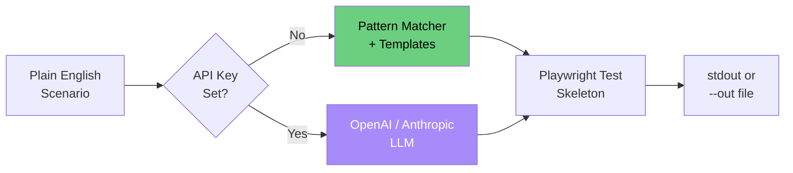

# Demo 01: Prompt-to-Test Generator

**Convert plain English test scenarios into Playwright test skeletons — in seconds.**

---

## What This Demo Proves

- AI can dramatically accelerate test authoring
- Plain-English specs can be reliably translated to executable test code
- Teams can adopt this pattern **without paid APIs** using deterministic templates
- Optional cloud LLMs (OpenAI) plug in via environment variable

---

## How to Run

```bash
# Default mode — offline, deterministic mock generator
python generator.py "test user login with valid credentials"

# With a more complex scenario
python generator.py "verify checkout flow with credit card payment"

# Output to a file
python generator.py "test password reset email flow" --out generated_test.py

# Use real OpenAI API (optional)
export OPENAI_API_KEY=sk-...
python generator.py "test admin user permissions"
```

---

## Example Input

```
test user login with valid credentials
```

## Example Output

```python
"""
Generated Playwright test: test user login with valid credentials
"""
from playwright.sync_api import Page, expect


def test_user_login_with_valid_credentials(page: Page) -> None:
    # Step 1: Navigate to the application
    page.goto("https://example.com")

    # Step 2: Locate login elements
    page.get_by_label("Email").fill("user@example.com")
    page.get_by_label("Password").fill("secure-password")

    # Step 3: Perform the login action
    page.get_by_role("button", name="Login").click()

    # Step 4: Verify successful outcome
    expect(page.get_by_role("heading", name="Welcome")).to_be_visible()
    expect(page).to_have_url("https://example.com/dashboard")
```

See [`sample_output.py`](sample_output.py) for the full generated file.

---

## How to Present This Live

### The 60-Second Demo

1. **Set the scene** (10s)  
   "Writing a Playwright test for a login flow usually takes 15-30 minutes. Watch this."

2. **Run the command** (5s)
   ```bash
   python generator.py "test user login with valid credentials"
   ```

3. **Show the output** (15s)  
   Walk through the generated test file. Highlight:
   - Proper Playwright imports
   - Accessibility-first locators (`get_by_role`, `get_by_label`)
   - Logical step structure
   - Assertion patterns

4. **Run a second, more complex example** (15s)
   ```bash
   python generator.py "verify checkout flow with credit card payment and email confirmation"
   ```

5. **Land the message** (15s)  
   "This took 5 seconds. A human would take 30 minutes. Imagine this scaled to 100 tests."

### Advanced Demo (3 minutes)

If audience asks "but can it use real AI?":
```bash
export OPENAI_API_KEY=sk-...
python generator.py "test the multi-step onboarding wizard with form validation"
```

The same command now produces an even more contextual test using GPT-4.

---

## Architecture



---

## Files in This Demo

| File | Purpose |
|------|---------|
| `generator.py` | Main CLI entry point |
| `mock_ai.py` | Deterministic offline test generator |
| `templates.py` | Playwright test templates |
| `sample_output.py` | Reference output for verification |

---

## Where AI Adds Value

| Without AI | With AI |
|------------|---------|
| Manual test writing: 15-30 min/test | Test generation: 5-10 sec/test |
| Locator decisions require expertise | AI suggests accessible locators |
| Inconsistent test structure across team | Standardized templates enforced |
| Onboarding new testers takes weeks | New hires productive day one |

---

## Extension Ideas (for Capstone)

- Plug into Jira: read a ticket → generate matching test
- Add a `--review` mode that compares generated test to existing suite
- Integrate with Page Object Model auto-detection
- Generate negative test cases automatically
