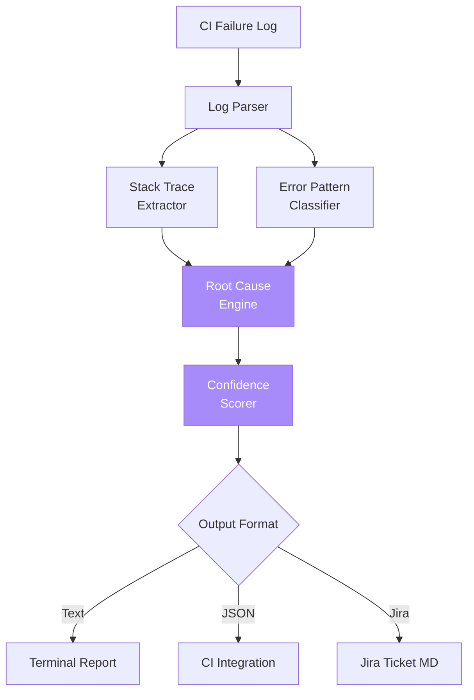

# Demo 02: AI Failure Analyzer

**Turn cryptic CI failure logs into actionable root-cause reports and Jira ticket drafts — instantly.**

---

## What This Demo Proves

- AI can parse and categorize test failure logs faster than humans
- Common Playwright failures (timeouts, locator misses, network errors) map predictably to root causes
- Auto-generated Jira tickets save 30+ minutes per failure
- The pattern works **offline** with deterministic classification

---

## How to Run

```bash
# Analyze the bundled sample failure log
python analyzer.py sample-failure.log

# Analyze your own log
python analyzer.py /path/to/your/playwright-output.log

# Output as JSON (for CI integration)
python analyzer.py sample-failure.log --format json

# Output a Jira-ready Markdown ticket
python analyzer.py sample-failure.log --format jira
```

---

## Example Input

A standard Playwright failure log (excerpt from `sample-failure.log`):

```
TimeoutError: page.click: Timeout 30000ms exceeded.
Call log:
  - waiting for locator('button.checkout-now')
  - locator resolved to <button class="checkout-now" disabled>...</button>
  - element is not enabled

  at /tests/checkout.spec.ts:42:12
```

## Example Output

```
🔍 AI Failure Analysis Report
═══════════════════════════════════════════════════════════
Test:           tests/checkout.spec.ts:42
Failure Type:   ELEMENT_DISABLED
Severity:       HIGH
Confidence:     92%

Root Cause:
  The checkout button is rendered but disabled when the click
  occurs. This typically means form validation has not passed
  or required state (e.g., cart contents, address selection)
  is missing.

Likely Causes (ranked):
  1. [HIGH]    Required form fields not filled before click
  2. [MEDIUM]  Cart state not loaded — race condition
  3. [LOW]     Backend validation API returned an error

Suggested Fix:
  • Wait for the button to be enabled before clicking:
      await expect(page.locator('button.checkout-now'))
          .toBeEnabled({ timeout: 10000 });
  • Add prerequisite assertions on cart/address state
  • Verify network requests completed before action

📋 Draft Jira Ticket → ticket.md
```

See [`sample_output.txt`](sample_output.txt) for the full report.

---

## How to Present This Live

### The Demo Script (2 minutes)

1. **Show the raw log** (15s)  
   Open `sample-failure.log` and let the audience see how dense and unhelpful it is.  
   "When this fails at 2 AM, an on-call engineer spends 30 minutes parsing this."

2. **Run the analyzer** (5s)
   ```bash
   python analyzer.py sample-failure.log
   ```

3. **Walk through the output** (60s)
   - Failure classification (`ELEMENT_DISABLED`)
   - Ranked likely causes
   - Concrete code fix suggestion
   - Confidence score

4. **Show the Jira ticket draft** (30s)
   ```bash
   python analyzer.py sample-failure.log --format jira > ticket.md
   cat ticket.md
   ```

5. **Land the message** (10s)  
   "30 minutes of triage → 30 seconds. Across 50 weekly CI failures, that's 25 hours/week saved."

---

## Architecture



---

## Files in This Demo

| File | Purpose |
|------|---------|
| `analyzer.py` | Main CLI entry point |
| `patterns.py` | Failure pattern definitions and root-cause rules |
| `sample-failure.log` | Realistic Playwright failure log |
| `sample_output.txt` | Reference report output |

---

## Failure Patterns Recognized

| Pattern | Common Cause | Auto-Suggestion |
|---------|--------------|-----------------|
| `TimeoutError` + `not enabled` | Disabled element | Wait for enabled state |
| `TimeoutError` + `not visible` | Element hidden/late render | Wait for visibility |
| `strict mode violation` | Multiple matches | Refine locator |
| `Connection refused` | Service down | Check dependencies |
| `expect(...).toBe...` | Assertion mismatch | Review fixture data |
| `net::ERR_` | Network/DNS issue | Check API/CDN |

---

## Where Real AI Adds Value

The offline mock uses pattern matching. With a real LLM (OPENAI_API_KEY set), the analyzer can:

- Summarize **novel** error messages it has never seen
- Cross-reference recent commits to suggest culprit changes
- Detect cascading failures across multiple tests
- Generate context-aware fix suggestions tailored to your codebase

---

## Extension Ideas (for Capstone)

- Slack notification with one-click "Acknowledge" / "Auto-Fix"
- GitHub PR comment when CI fails
- Track failure trends across releases
- Auto-assign Jira tickets based on file ownership (`CODEOWNERS`)
