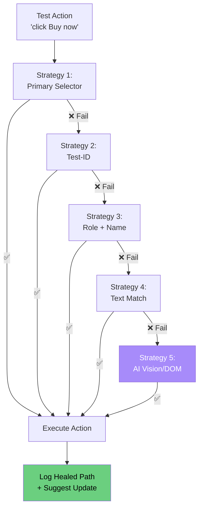

# Demo 03: Self-Healing Locators

**Demonstrate a resilient locator strategy that automatically falls back when selectors break.**

---

## What This Demo Proves

- Brittle CSS selectors (`#submit-btn-v2`) break the moment frontend code changes
- A layered fallback strategy — **test-id → role+name → text → AI suggestion** — survives many common selector changes when semantic signals remain stable
- Self-healing tests reduce flaky failures and maintenance burden
- The same pattern works in Playwright, Selenium, and Cypress

---

## How to Run

```bash
# Run the self-healing locator demo against a static HTML fixture
python heal.py
```

This will:
1. Load `fixture.html` (a sample product page)
2. Try a broken primary selector (`#old-buy-button`)
3. Walk through fallback strategies until one succeeds
4. Print the resolution path

---

## Example Output

```
🩹 Self-Healing Locator Demo
═══════════════════════════════════════════════════════════
Target action: click "Buy now" button

[1/4] Trying primary selector:    #old-buy-button
      ❌ FAILED (element not found — DOM has changed)

[2/4] Trying test-id fallback:    [data-testid="buy-now"]
      ❌ FAILED (no matching test-id)

[3/4] Trying role + name:         role=button, name="Buy now"
      ✅ SUCCESS — resolved to <button class="btn-primary">Buy now</button>

✨ Healed in 3 steps. Suggested test update:
   - page.locator('#old-buy-button')
   + page.get_by_role('button', name='Buy now')

📊 Heal stats:
   Strategies tried:     3
   Final strategy:       ROLE_NAME
   Time to heal:         12ms
```

See [`sample_output.txt`](sample_output.txt) for full output.

---

## How to Present This Live

### The Demo Script (90 seconds)

1. **Show the broken test** (15s)  
   Open `fixture.html` — point out the button no longer has `#old-buy-button`.  
   "Yesterday this test worked. Today the dev team renamed the button. Watch what happens."

2. **Show the traditional failure** (10s)  
   "In a normal test framework: red CI, on-call ping, 30-min triage."

3. **Run the self-healing demo** (15s)
   ```bash
   python heal.py
   ```

4. **Walk through the output** (30s)
   - Layer 1 (CSS ID): fails
   - Layer 2 (test-id): fails
   - Layer 3 (role + name): succeeds
   - Suggested code update

5. **Land the message** (20s)  
   "Three fallback layers. The test passed. The CI is green. The team gets a Slack notification: 'your selector strategy has drifted, here's the suggested fix.'"

---

## Architecture



---

## The Fallback Hierarchy

| Strategy | Why It's Resilient | When It Breaks |
|----------|--------------------| ---------------|
| **1. Primary CSS** | Fast, explicit | DOM/class refactors |
| **2. Test-ID** | Stable contract with dev team | Missing test-ids on new components |
| **3. Role + Name** | Accessibility-first, semantic | Aria labels change |
| **4. Text Match** | User-visible content | Copy changes / i18n |
| **5. AI Vision** | Pixel/semantic understanding | Costly, slower, and still needs confidence gates |

---

## Files in This Demo

| File | Purpose |
|------|---------|
| `heal.py` | Self-healing locator engine |
| `fixture.html` | Sample product page with renamed elements |
| `sample_output.txt` | Reference run output |

---

## Where AI Adds Value

The default demo is **rule-based** (no AI). Real AI integration would:

- **Vision-based fallback:** a vision-capable model identifies the button from screenshot and DOM context
- **DOM semantic search:** Embedding-based "find the button that means 'Buy'"
- **Historical learning:** Train on past selector drift patterns
- **Auto-PR generation:** Open a pull request with the suggested fix

The hook in `heal.py` (`def ai_fallback`) shows exactly where the LLM plugs in.

---

## Extension Ideas (for Capstone)

- Track heal-rate per selector across CI runs (observability dashboard)
- Auto-open a PR when a heal occurs (`gh pr create`)
- Train a small model on your codebase's locator patterns
- Add a "selector linter" that warns when devs write brittle selectors
