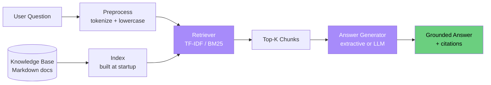

# Demo 04: RAG QA Assistant

**A knowledge-grounded Q&A assistant for testing teams — runs offline, cites its sources.**

---

## What This Demo Proves

- RAG (Retrieval-Augmented Generation) can be implemented **without** heavy vector DBs
- Even simple TF-IDF retrieval produces useful grounded answers
- Cited sources eliminate hallucination concerns for stakeholders
- This pattern unlocks **instant onboarding**: ask the assistant any question about your testing strategy

---

## How to Run

```bash
# Ask a question
python rag.py "How do I add a new test to the CI pipeline?"

# Another question
python rag.py "What is the policy on flaky tests?"

# Inspect the knowledge base
python rag.py --list-sources
```

---

## Example Input

```
How do I add a new test to the CI pipeline?
```

## Example Output

```
🧠 RAG QA Assistant
═══════════════════════════════════════════════════════════
Question: How do I add a new test to the CI pipeline?

📚 Retrieved 2 relevant document(s):
   1. ci-pipeline.md         (relevance: 0.78)
   2. testing-standards.md   (relevance: 0.41)

💡 Answer:
   To add a new test to the CI pipeline, place your spec file in
   the tests/ directory. The CI workflow automatically discovers
   files matching `*.spec.ts` or `*.spec.py` and runs them in
   parallel shards. Tag your test with @smoke or @regression to
   control which CI stage executes it.

🔖 Sources:
   • knowledge_base/ci-pipeline.md
   • knowledge_base/testing-standards.md
```

See [`sample_output.txt`](sample_output.txt) for full output.

---

## How to Present This Live

### The Demo Script (2 minutes)

1. **Set the scene** (15s)  
   "Imagine you're a new QA hire. You have 100 questions: 'How do I run tests locally?' 'What's the flaky test policy?' Today, you Slack 5 different people. Watch this instead."

2. **First question — practical** (20s)
   ```bash
   python rag.py "How do I run tests locally?"
   ```
   Highlight: the answer cites the actual doc file.

3. **Second question — policy** (20s)
   ```bash
   python rag.py "What is the flaky test policy?"
   ```
   Show how it grounds the answer in `testing-standards.md`.

4. **Third question — edge case** (20s)
   ```bash
   python rag.py "Can I disable a test?"
   ```
   Show how RAG handles questions without perfect keyword matches.

5. **Land the message** (45s)  
   - "Three questions answered in 5 seconds — each with a citation."
   - "No hallucination: every claim points to a source doc."
   - "Replace tribal knowledge with a queryable knowledge base."
   - "Drop in your real internal docs, add retrieval evals, and you have a credible pilot quickly."

---

## Architecture



---

## Files in This Demo

| File | Purpose |
|------|---------|
| `rag.py` | RAG pipeline CLI |
| `retriever.py` | TF-IDF retriever (stdlib only) |
| `knowledge_base/*.md` | Sample testing knowledge base |
| `sample_output.txt` | Reference run output |

---

## Knowledge Base Topics

| File | Topic |
|------|-------|
| `ci-pipeline.md` | How tests run in CI |
| `testing-standards.md` | Test quality bar, flaky test policy |
| `playwright-best-practices.md` | Locator strategies, fixtures, parallelization |
| `onboarding.md` | New-hire setup guide |

---

## How the Retrieval Works (No Vector DB Required)

1. At startup, every markdown file is tokenized and chunked
2. A simple **TF-IDF** index is built (term frequency × inverse document frequency)
3. The user query is tokenized the same way
4. Cosine similarity scores rank chunks
5. The top-K chunks are passed to the answer generator

For larger knowledge bases (>1000 docs), swap the retriever for:
- **Chroma** or **Qdrant** (local vector DB)
- **OpenAI embeddings** (cloud)
- **sentence-transformers** (local, free)

The interface in `retriever.py` is designed to be drop-in replaceable.

---

## Where Real AI Adds Value

The default demo uses **extractive** answers (returns the most relevant chunk).
With `OPENAI_API_KEY` set, the answer generator can:

- Synthesize across multiple chunks
- Rephrase in the user's preferred style
- Handle complex multi-part questions
- Flag when no documents contain the answer (no hallucination)

The hook in `rag.py` shows where the LLM plugs in.

---

## Extension Ideas (for Capstone)

- Connect to your team's Confluence/Notion via API
- Add conversation memory ("follow-up question" support)
- Embed in Slack as a `/ask-qa` slash command
- Add document freshness scoring (newer = higher relevance)
- Track which questions can't be answered → identify doc gaps
