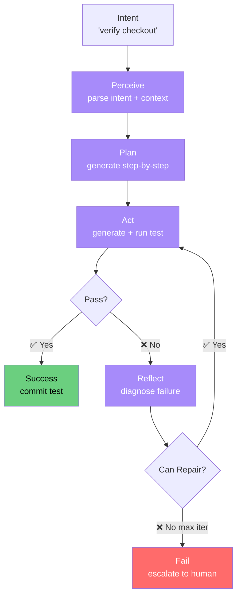

# Demo 05: Autonomous Playwright Agent

**The crown jewel: an agent loop that receives an intent, plans, generates a test, runs it, analyzes failure, and repairs — all autonomously.**

---

## What This Demo Proves

- AI agents can replace entire manual QA workflows
- The **perceive → plan → act → reflect** loop is universal across testing tools
- Even with simulated execution, the pattern is impressive and ready to drop a real Playwright runtime into
- This is the future of testing teams — the participants build this in Week 7

---

## How to Run

```bash
# Run the agent with a high-level intent
python agent.py --intent "verify checkout flow"

# Try a different intent
python agent.py --intent "test user login with valid credentials"

# Force a failure to see the self-repair loop in action
python agent.py --intent "verify checkout flow" --force-fail

# Verbose logging with all internal reasoning
python agent.py --intent "test password reset" --verbose
```

---

## Example Output (excerpt)

```
🤖 AUTONOMOUS PLAYWRIGHT AGENT
══════════════════════════════════════════════════════════════
Intent:   verify checkout flow
Started:  2026-05-19 14:32:01

┌─ PERCEIVE ──────────────────────────────────────────────────
│ Parsing intent...
│ ✓ Detected domain: e-commerce / checkout
│ ✓ Required actions: navigate → fill form → submit → verify
│ ✓ Confidence: 91%
└─────────────────────────────────────────────────────────────

┌─ PLAN ──────────────────────────────────────────────────────
│ Generating test plan...
│ ✓ Step 1: Navigate to /cart
│ ✓ Step 2: Click 'Proceed to checkout'
│ ✓ Step 3: Fill shipping form
│ ✓ Step 4: Fill payment details
│ ✓ Step 5: Click 'Place order'
│ ✓ Step 6: Assert order confirmation
└─────────────────────────────────────────────────────────────

┌─ ACT (iteration 1) ─────────────────────────────────────────
│ ✓ Generated test file: generated/test_verify_checkout_flow.py
│ ✓ Executing test...
│ ✗ FAILED: Step 5 — button.checkout-now is disabled
└─────────────────────────────────────────────────────────────

┌─ REFLECT ───────────────────────────────────────────────────
│ Analyzing failure...
│ ✓ Root cause: ELEMENT_DISABLED (confidence 92%)
│ ✓ Repair strategy: add toBeEnabled() wait before click
└─────────────────────────────────────────────────────────────

┌─ ACT (iteration 2) ─────────────────────────────────────────
│ ✓ Applied repair patch
│ ✓ Re-executing test...
│ ✓ PASSED — all 6 steps green
└─────────────────────────────────────────────────────────────

🎉 Mission accomplished in 2 iteration(s).
   • Test file:       generated/test_verify_checkout_flow.py
   • Total time:      4.2s
   • Self-repaired:   Yes (1 repair applied)
```

See [`sample_output.txt`](sample_output.txt) for the full run.

---

## How to Present This Live

### The Demo Script (3 minutes — the headline demo)

1. **Set the stage** (20s)  
   "Here's the punchline of this entire program. Watch an agent that does everything a junior QA engineer does — but in 4 seconds."

2. **Run with a clean intent** (40s)
   ```bash
   python agent.py --intent "test user login with valid credentials"
   ```
   Walk through the four phases: perceive, plan, act, reflect.

3. **Run with forced failure** (60s)
   ```bash
   python agent.py --intent "verify checkout flow" --force-fail
   ```
   This is the **magic moment**: the agent fails, reflects, repairs, and succeeds without human intervention.

4. **Show the generated file** (20s)
   ```bash
   cat ai-testing-accelerator/demos/05-autonomous-playwright-agent/generated/test_verify_checkout_flow.py
   ```
   Point out: real Playwright code, ready to commit.

5. **Land the message** (30s)  
   - "Now imagine 100 of these running in parallel against your codebase every night."
   - "Tests stay current. Flakes get repaired. Your QA team focuses on strategy, not maintenance."
   - "This is the capstone project — every participant ships one of these by Week 8."

---

## Architecture



---

## Files in This Demo

| File | Purpose |
|------|---------|
| `agent.py` | Main agent loop and CLI |
| `phases.py` | Implementation of perceive/plan/act/reflect |
| `runtime.py` | Mock Playwright runtime (drop in real one for production) |
| `generated/` | Output directory for generated tests (gitignored) |
| `sample_output.txt` | Reference run output |

---

## The Agent Loop, Explained

| Phase | What It Does | Where AI Plugs In |
|-------|--------------|-------------------|
| **Perceive** | Parses the intent, extracts domain + actions | LLM intent classifier |
| **Plan** | Generates a step-by-step test plan | LLM test generator |
| **Act** | Writes code, executes via Playwright | Code generation + real runtime |
| **Reflect** | Analyzes failure logs, proposes repair | LLM root-cause analysis |
| **Repeat** | Applies repair, re-runs (up to N times) | Loop with guardrails |

---

## Production Path

The default demo uses simulated execution. To go production:

1. Install Playwright: `pip install playwright && playwright install`
2. Replace `runtime.mock_execute()` with `subprocess.run(["pytest", test_file])`
3. Set `OPENAI_API_KEY` for real LLM reasoning in `phases.py`
4. Add observability (Langsmith, Helicone, or DataDog)

---

## Extension Ideas (for Capstone)

- Connect to Jira: read tickets → auto-generate matching tests
- Slack notifications on success/failure with embedded code diff
- Confidence-gated auto-merge (only merge if confidence > 95%)
- Multi-agent orchestration (planner, coder, reviewer agents)
- Learning loop: track which repairs work, prefer those next time
